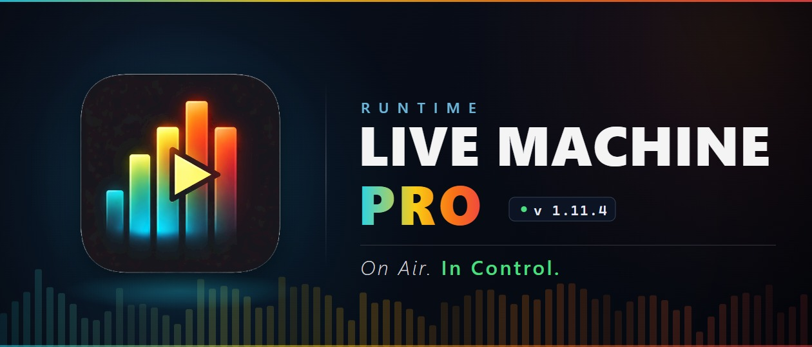

# Runtime Live Machine Pro — il progetto si è spostato

> ### 👉 **[github.com/Pitz72/RRLMP](https://github.com/Pitz72/RRLMP)**

Dal settembre 2026 **Runtime Live Machine Pro è software libero**, rilasciato sotto **licenza MIT**.
Codice sorgente, release, manuali e segnalazioni stanno ora nel repository del progetto:
**[github.com/Pitz72/RRLMP](https://github.com/Pitz72/RRLMP)**.

Questa repository ospitava le release compilate della fase commerciale. Resta online **solo come
ponte**: l'ultima release qui, la **v1.15.33**, è identica a quella del nuovo repository e porta con
sé chi ha già il programma installato. Da quella versione in poi l'app cercherà gli aggiornamenti
direttamente su `Pitz72/RRLMP`. **Non serve fare nulla**: basta accettare l'aggiornamento.

- **Download:** [pagina Releases del progetto](https://github.com/Pitz72/RRLMP/releases)
- **Manuale utente:** [italiano](https://github.com/Pitz72/RRLMP/raw/master/manuale-utente/typst/Manuale-Utente-IT.pdf) · [English](https://github.com/Pitz72/RRLMP/raw/master/manuale-utente/typst/User-Manual-EN.pdf)
- **macOS:** nessun installer ufficiale; si compila dal sorgente (vedi `CONTRIBUTING.md` nel progetto)

Questa repository verrà archiviata e poi rimossa quando la migrazione sarà completa.

---

# Runtime Live Machine Pro — the project has moved

Since September 2026 **Runtime Live Machine Pro is free software**, released under the **MIT licence**.
Source code, releases, manuals and issues now live at **[github.com/Pitz72/RRLMP](https://github.com/Pitz72/RRLMP)**.

This repository hosted the compiled releases of the commercial phase. It stays online **only as a
bridge**: its last release, **v1.15.33**, is identical to the one on the new repository and carries
existing installations over. From that version on, the app looks for updates directly on
`Pitz72/RRLMP`. **Nothing to do**: just accept the update.

---

*Runtime Live Machine Pro — On Air. In Control.*
